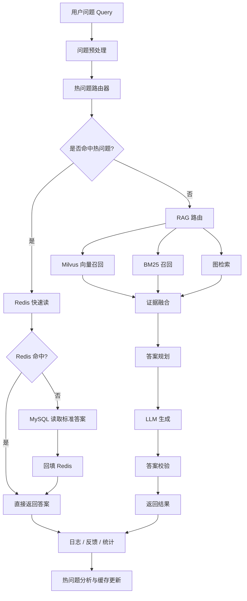

# Minecraft GraphRAG 项目统筹说明

> 这份文档的目的，是让后续任何新聊天、任何新协作者、任何 AI 代理都能快速接上当前项目，不需要重新猜测上下文。
>
>

项目 Python：
D:\codex\Graphrag\.env\Scripts\python.exe以后所有 Python 测试、pip 安装和运行项目，都使用这个解释器，不要使用系统 Python。

## 1. 项目目标

本项目是在做一个面向 Minecraft 知识问答的 AI 系统，核心目标不是“单纯聊天”，而是让系统能根据问题类型选择最合适的回答路径：

- 特别常见、答案稳定、低歧义的问题，走 `Redis + MySQL` 快速通道
- 不常见、复杂、多跳、需要证据支撑的问题，走 `RAG` 通道
- `Milvus` 负责向量召回，不承担主数据职责
- 知识图谱负责实体、关系、多跳推理和证据溯源

这个项目的关键不是“把所有知识都塞进一个库”，而是“让不同类型的问题走不同的通道”。

## 2. 当前已确认的核心设计

### 2.1 总体分流策略

当前确认的在线查询策略是：

1. 用户问题进入问题理解层
2. 先判断是不是热问题、常见问题、标准问题
3. 如果是，优先走 `Redis + MySQL` 快速通道
4. 如果不是，进入 `RAG` 通道
5. RAG 通道内部并行使用 `Milvus`、`BM25`、图检索
6. 召回后进行证据融合、重排、压缩
7. 再由 LLM 生成答案并校验

### 2.2 存储职责边界

已明确的职责边界如下：

- `Redis`
  - 热点答案缓存
  - 会话状态
  - 最近查询结果
  - 快速返回

- `MySQL`
  - 标准问答库
  - 结构化元数据
  - 统计数据
  - 缓存回源
  - 如果需要，也可作为热题沉淀表

- `Milvus`
  - chunk embedding 存储
  - 语义相似召回
  - top-k 候选片段返回

- `知识图谱`
  - 实体
  - 关系
  - 多跳推理
  - 证据来源追溯
  - 版本相关知识表达

## 3. 项目运行方式

### 3.1 离线构建流程

离线知识摄取流程如下：

```text
文档 / 网页 / 游戏资料
→ 清洗
→ 切块
→ 实体抽取
→ 关系抽取
→ 图谱构建
→ chunk embedding
→ 写入 Milvus
→ 写入图数据库
→ 写入 MySQL 标准答案或热题来源
```

### 3.2 在线查询流程

在线查询流程如下：

```text
用户问题
→ 问题理解
→ 热问题判断
→ Redis / MySQL 快速通道
→ 或 Milvus + 图谱 + BM25 的 RAG 通道
→ 证据融合
→ 回答规划
→ LLM 生成
→ 校验输出
→ 返回答案
```

## 4. 推荐架构图



## 5. 问题类型与路由原则

### 5.1 适合走快速通道的问题

这类问题通常具备以下特征：

- 高频
- 答案稳定
- 低歧义
- 低版本敏感
- 结果适合标准化

典型例子：

- 某物品怎么合成
- 某生物掉什么
- 某指令怎么写
- 某机制是否存在

### 5.2 适合走 RAG 的问题

这类问题通常具备以下特征：

- 长尾
- 需要多跳推理
- 需要证据引用
- 版本差异敏感
- 表达方式不固定

典型例子：

- 某生物在特定版本中的行为差异
- 某机制与另一机制的联动关系
- 某结构的生成条件和位置规律
- 需要结合多个文档才能回答的问题

## 6. Minecraft 场景的特别约束

Minecraft 知识最容易出错的地方，是把不同版本、不同版本分支、不同模组环境混在一起。因此必须明确加上这些约束：

- `game_version`
- `modpack_version`
- `server_version`
- 如果有需要，增加 `dimension` 或 `edition`

建议所有知识对象都尽量带版本标签，否则缓存和图谱都会出现“看似对、其实错”的答案。

## 7. 图谱设计原则

图谱不是“相关词集合”，而是“可追溯证据网络”。

建议实体和关系尽量明确：

- 实体类型
  - `item`
  - `block`
  - `mob`
  - `biome`
  - `structure`
  - `recipe`
  - `enchantment`
  - `potion`
  - `command`
  - `mechanic`

- 关系类型
  - `crafted_from`
  - `drops`
  - `spawns_in`
  - `used_for`
  - `requires`
  - `transforms_to`
  - `counters`
  - `found_in`
  - `enabled_by_version`

每个实体和关系最好都保留：

- source chunk
- evidence sentence
- confidence
- version
- update time

## 8. RAG 通道的处理原则

RAG 通道不能只是“取 top-k 然后丢给 LLM”。建议按以下顺序执行：

1. 并行召回
   - `Milvus`
   - `BM25`
   - 图检索

2. 合并去重

3. 证据重排

4. 证据压缩

5. 上下文组装

6. 回答规划

7. LLM 生成

8. 答案校验

上下文最好按预算分层：

- 核心证据
- 辅助证据
- 兜底证据

## 9. 缓存与热题沉淀机制

系统应把高频问题不断沉淀成更快的路径：

- 新问题先进入查询流程
- 统计问题频次与命中质量
- 当某类问题稳定且高频时，沉淀到 `MySQL`
- 再写入 `Redis`
- 下一次直接走快路径

这意味着系统是“越用越快”的，而不是每次都完整走 RAG。

## 10. 对后续实现的统一约定

后续任何实现都应遵守这些约定：

- 快问题优先快路径
- 长尾问题优先 RAG
- `Milvus` 只负责向量召回
- `MySQL` 只负责标准答案、元数据、统计和回源
- 图谱必须保留证据与版本
- 生成答案前必须先做证据融合
- 答案输出后最好有校验层

## 11. 当前待细化的问题

下面这些问题还没有完全收敛，后续如果继续推进，建议优先补齐：

- 热问题判定的阈值如何定义
- 哪些问题可以稳定进入 MySQL 标准答案库
- 图数据库用什么具体实现
- 证据融合的评分规则
- 是否需要单独的答案校验模型
- 版本隔离要做到什么粒度

## 12. 建议的后续推进顺序

如果继续做，推荐按这个顺序推进：

1. 先把问题路由规则定下来
2. 再把 MySQL / Redis / Milvus / 图谱的职责边界定死
3. 再做离线知识摄取流水线
4. 再做在线检索和证据融合
5. 再做答案校验和反馈闭环
6. 最后做评测集和指标体系

## 13. 这份文档的使用方式

如果你进入一个新的聊天，请优先把这份文档当成上下文入口。
读完它以后，新的协作方应当知道：

- 这个项目在做什么
- 哪些路径是快路径，哪些是 RAG 路径
- 每个组件的职责是什么
- 知识如何进入系统
- 问题如何进入系统
- 答案如何出来

## 14. 相关文件

- 当前架构说明：[ARCHITECTURE.md](./ARCHITECTURE.md)

