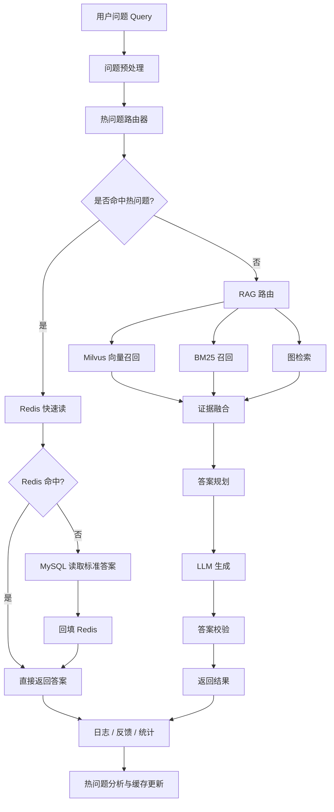
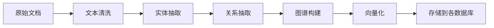
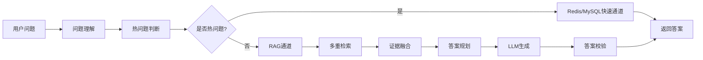

# Minecraft GraphRAG - 知识问答系统

  *(实际项目中应替换为Minecraft标志)*

## 项目概述

Minecraft GraphRAG 是一个面向 Minecraft 知识问答的 AI 系统，采用多通道问答架构，能够根据问题类型自动选择最优回答路径。核心目标是让系统根据问题类型选择最合适的回答路径：

- **热问题**（高频、答案稳定、低歧义）：走 `Redis + MySQL` 快速通道
- **冷问题**（长尾、复杂、多跳、需要证据支撑）：走 `RAG` 通道

## 系统架构

### 总体架构图



### 核心组件

1. **快速通道 (MySQL + Redis)**
   - 处理高频、答案稳定、低歧义的问题
   - 使用 Redis 缓存热点答案
   - 使用 MySQL 存储标准问答库

2. **RAG通道 (Milvus + 知识图谱 + BM25)**
   - 处理复杂、需要多跳推理的问题
   - 使用 Milvus 进行向量召回
   - 使用知识图谱进行多跳推理
   - 使用 BM25 进行关键词检索

3. **大模型层**
   - 使用大模型生成最终答案
   - 支持证据融合和答案校验

## 项目结构

```
mcGraph/
├── 📁 base/                 # 基础工具模块
│   ├── config.py           # 配置文件管理
│   └── logger.py           # 日志工具
├── 📁 data/                 # 数据目录
│   ├── 📁 processed/        # 处理后的数据
│   └── 📁 raw/              # 原始数据
├── 📁 mysql_qa/             # MySQL快速问答模块
│   ├── 📁 cache/           # 缓存相关
│   ├── 📁 db/              # 数据库相关
│   ├── 📁 retrieval/        # 检索模块
│   └── main.py             # MySQL Q&A 主入口
├── 📁 rag_qa/               # RAG问答模块
│   └── 📁 core/            # RAG核心组件
│       ├── prompts.py      # 提示词模板
│       ├── query_classifier.py # 查询分类器
│       ├── rag_system.py    # RAG系统主类
│       └── strategy_selector.py # 策略选择器
├── 📁 src/                  # 源代码目录
│   └── 📁 data_processing/ # 数据处理模块
│       ├── entity_extraction.py # 实体抽取
│       ├── knowledge_graph.py   # 知识图谱构建
│       ├── relation_extraction.py # 关系抽取
│       ├── text_cleaning.py     # 文本清洗
│       └── vector_indexing.py   # 向量索引
├── 📄 config.ini            # 系统配置文件
├── 📄 main.py              # 主程序入口
└── 📄 requirements.txt     # Python依赖
```

## 核心功能

### 1. 热问题快速通道

- **Redis缓存**：存储热点答案和会话状态
- **MySQL标准答案库**：存储高频问题的标准答案
- **BM25检索**：快速判断问题类型

### 2. RAG通道

- **多模态检索**：并行使用向量、关键词、图谱检索
- **证据融合**：融合不同来源的证据
- **策略选择**：根据问题类型选择最优检索策略
- **大模型生成**：生成最终答案

### 3. 知识图谱

- **实体类型**：item, block, mob, biome, structure, recipe, enchantment, potion, command, mechanic
- **关系类型**：crafted_from, drops, spawns_in, used_for, requires, transforms_to, counters, found_in, enabled_by_version
- **证据追溯**：每个实体和关系都保留原始证据

## 数据流程

### 离线处理流程



### 在线查询流程



## 配置说明

### config.ini 配置文件

首次运行时将 `config.example.ini` 复制为 `config.ini`，再填写本机的 MySQL 和 Redis 密码。`config.ini` 和 `.env` 都不会提交到 Git。

```ini
# 数据库配置
[database]
host = localhost
port = 3306
username = root
password =
database_name = mcgraphrag

# 缓存配置
[cache]
redis_host = localhost
redis_port = 6379
redis_db = 0
password =

# RAG配置
[rag]
embedding_model = BGE-m3
chunk_size = 1000
chunk_overlap = 200
top_k = 5

# Milvus配置
[milvus]
host = localhost
port = 19530
database_name = mcrag
collection_name = mc_123

# 检索配置
[search]
bm25_top_k = 10
search_threshold = 0.5

# 日志配置
[logging]
log_level = INFO
log_file = logs/app.log
max_file_size = 10485760
backup_count = 5
```

## 使用方法

### 百炼模型配置

项目根目录的 `.env` 保存模型服务配置，已被 Git 忽略。可参考 `.env.example`：

```dotenv
DASHSCOPE_BASE_URL=https://dashscope.aliyuncs.com/compatible-mode/v1
DASHSCOPE_MODEL_NAME=qwen-plus
DASHSCOPE_API_KEY=填入你的百炼API密钥
```

上面的地址适用于北京地域的按量计费密钥；其他地域或套餐需要使用对应的地址和密钥。配置密钥后，冷问题会将问题和检索证据发送给百炼生成回答；未配置密钥或调用失败时，使用本地证据回答。

### 1. 初始化问答系统

```python
from main import IntegratedQASystem

# 创建问答系统
qa_system = IntegratedQASystem()
```

### 2. 处理查询

```python
# 处理用户查询
result = qa_system.process_query("钻石镐怎么制作")

# 检查结果
if result['success']:
    print(f"答案: {result['data']['answer']}")
    print(f"来源: {result['source']}")
```

### 3. 关闭系统

```python
# 关闭系统
qa_system.close()
```

## 安装和运行

### 1. 环境准备

```bash
# 创建虚拟环境
python -m venv D:\codex\Graphrag\.env

# 激活虚拟环境
# Windows
D:\codex\Graphrag\.env\Scripts\activate.bat

# Linux/Mac
source D:\codex\Graphrag\.env/bin/activate
```

### 2. 安装依赖

```bash
pip install -r requirements.txt
```

本地 BGE-M3 权重放在 `model/bge-m3`。模型文件较大，已被 Git 忽略；在新机器克隆仓库后，需要单独准备模型文件才能使用 Milvus 向量检索。

### 3. 运行系统

```bash
python main.py
```

## 测试示例

```python
def test_qa_system():
    qa_system = IntegratedQASystem()
    
    test_queries = [
        "钻石镐怎么制作",      # 热问题（合成类）
        "苦力怕的特性",       # 热问题（生物类）
        "末地传送门建造",     # 冷问题（机制类）
        "红石电路原理",       # 冷问题（机制类）
        "水方块怎么获得"      # 热问题（获取类）
    ]
    
    for query in test_queries:
        print(f"\n查询: '{query}'")
        result = qa_system.process_query(query)
        print(f"结果: {result['message']}")
    
    qa_system.close()

if __name__ == "__main__":
    test_qa_system()
```

## 版本控制

Minecraft 知识最容易出错的地方，是把不同版本、不同版本分支、不同模组环境混在一起。因此必须明确加上这些约束：

- `game_version` - 游戏版本
- `modpack_version` - 模组包版本  
- `server_version` - 服务器版本
- `dimension` - 维度（可选）
- `edition` - 版本（可选）

建议所有知识对象都尽量带版本标签，否则缓存和图谱都会出现"看似对、其实错"的答案。

## 贡献指南

### 1. 代码规范

- 遵循 PEP 8 代码规范
- 添加适当的注释和文档字符串
- 编写单元测试

### 2. 提交规范

- 使用清晰的提交信息
- 分支命名规范：`feature/xxx` 或 `fix/xxx`
- Pull Request 需要包含测试用例

### 3. 开发流程

1. Fork 项目
2. 创建功能分支
3. 编写代码和测试
4. 提交 Pull Request
5. 等待代码审查

## 许可证

本项目采用 MIT 许可证 - 查看 [LICENSE](LICENSE) 文件了解详情。

## 联系方式

- 项目维护者：[您的姓名/组织]
- 邮箱：[您的邮箱]
- GitHub：[您的GitHub仓库]

## 相关文档

- [PROJECT_COORDINATION.md](PROJECT_COORDINATION.md) - 项目统筹说明
- [代码结构.md](代码结构.md) - 代码结构说明
- [ARCHITECTURE.md](ARCHITECTURE.md) - 架构设计文档

--- 

*注意：这是一个 Minecraft 知识问答系统，旨在提供准确、可靠的游戏知识回答。请确保在使用时遵守 Minecraft 的使用条款和条件。*
